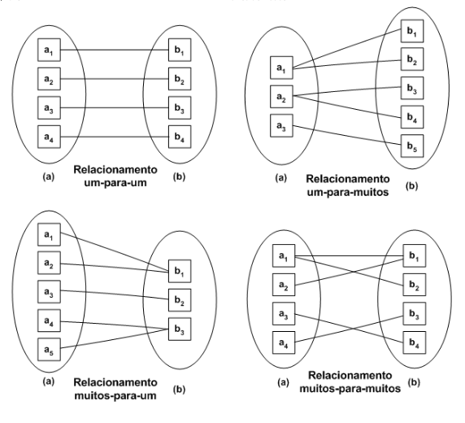
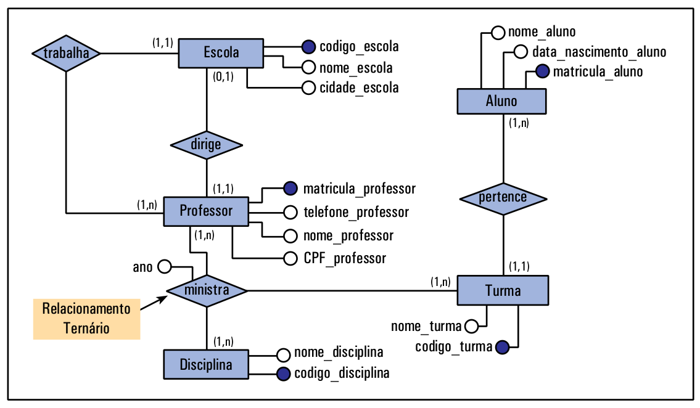
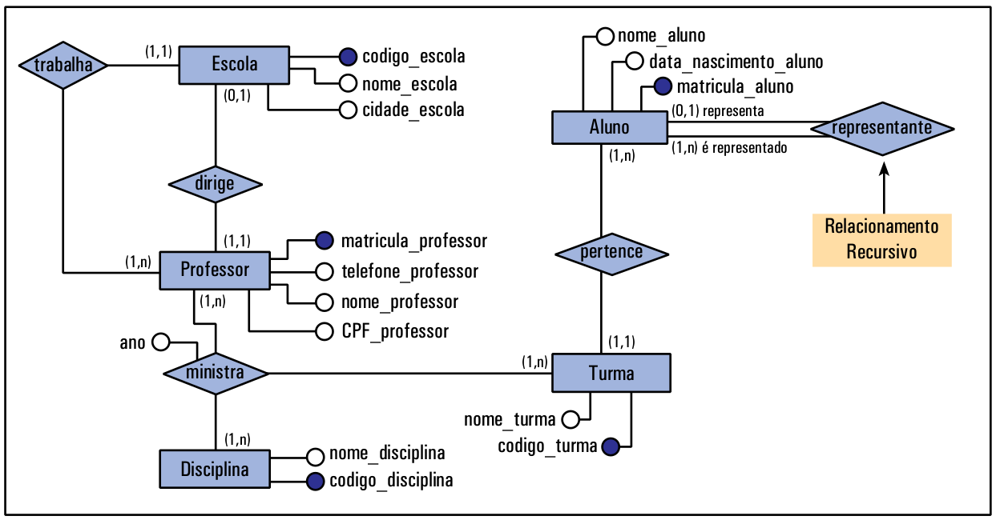
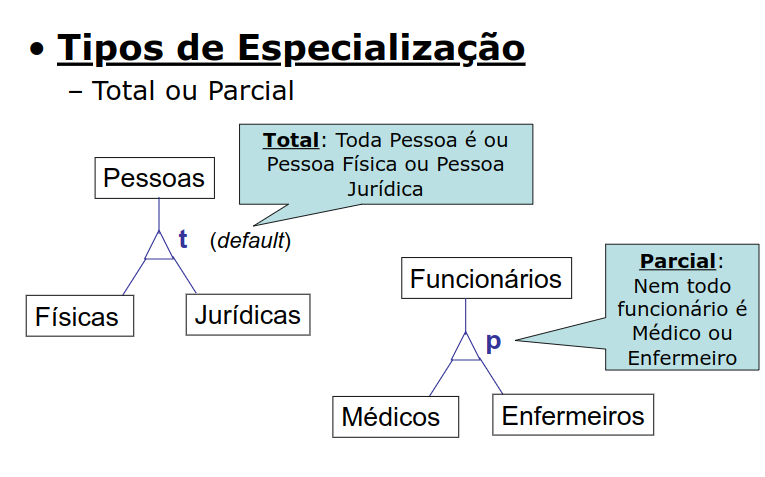
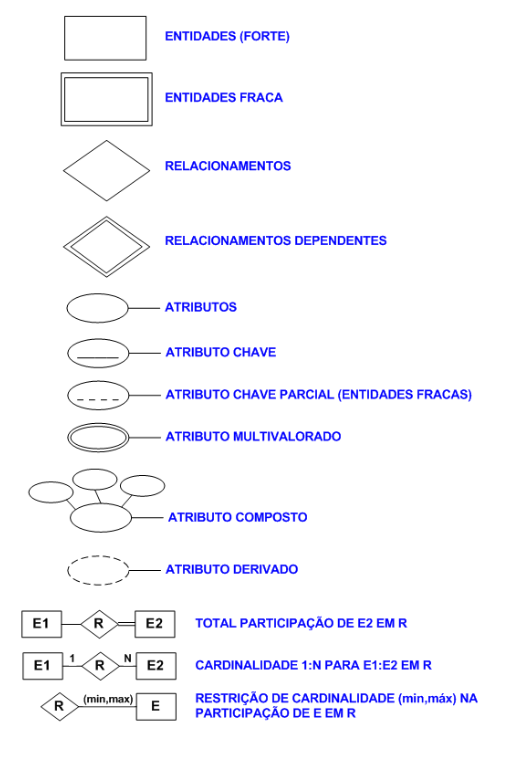
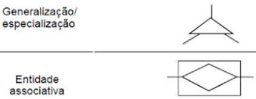

# Relacionamento - ER

Um relacionamento é uma associação entre as **entidades**.
Os dados devem estar armazenados e estarem relacionados na base de dados para que possamos utilizá-los eficientemente.

Ex: Esse relacionamento entre dados é que nos permite descobrir, dada duas entidades como **Aluno** e **Turma**, a qual turma um aluno pertence.

Um relacionamento é representado por um losango com o nome do relacionamento no centro. O nome do 
relacionamento representa a relação que existe entre os objetos das entidades. O nome do relacionamento pode ser um **verbo** como, por exemplo, **pertence**, **leciona**, **estuda**, **possui**, etc; ou também pode ser uma composição dos nomes das entidades como por exemplo **Aluno_Turma** em vez de **pertence**.

Um relacionamento pode ter atributos. Esses atributos são denominados **atributos descritivos**.

Ex: Imagine que seja necessário armazenar a **data** que um **professor** lecionou determinada disciplina. O **atributo** **data** **não pertence nem à entidade Professor e nem à entidade Disciplina**. Esse atributo pertence ao relacionamento **leciona**, ou seja, é um atributo do relacionamento. E ele só deve ser preenchido com um valor, quando for feita a relação entre **professor** e **disciplina**.

## Cardinalidade

As restrições de mapeamento ou cardinalidade expressam o número de objetos de uma entidade ao qual outra entidade pode ser associada, via um relacionamento.

Para descobrir a cardinalidade de um relacionamento, a pergunta que deve ser feita é:**"Se eu pegar um único objeto da minha entidade X, a quantos objetos da entidade Y ele pode se associar?"**

Isto é, se eu pegar o objeto *Elaini* da entidade **Professor**, esse objeto *Elaini* poderá lecionar quantas disciplinas da entidade **Disciplina**? E se eu pegar o objeto *Banco de dados* da entidade **Disciplina**, a quantos professores ele poderá estar relacionado?

Esse número de associações entre objetos pode ser 0,1 ou vários (representado por N). No caso do exemplo de Professor e Disciplina a cardinalidade do modelo é N para N, permitindo que um professor lecione várias disciplinas e que uma disciplina seja ministrada por mais de um professor. Por exemplo, a disciplina de Banco de dados poderia ser ministrada pela profª. Elaini e pelo prof. João. Além de Banco de dados,a profª. Elaini poderia lecionar também, a disciplina de Análise de Projetos.

A cardinalidade de relacionamentos podem ser de 3 tipos: **Um para Um**, **Um para Muitos** e **Muitos para Muitos**.

## Cardinalidade Um para Um (1:1)

A cardinalidade (1:1) ocorre quando um objeto de uma entidade pode se relacionar a apenas um objeto de outra entidade e vice-e-versa. Imagine que você esteja desenvolvendo um sistema para uma rede de escolas. Cada escola terá um diretor (que é um professor da escola), e este diretor só poderá dirigir uma escola. Sendo assim, o relacionamento **dirige** entre as entidades **Escola** e **Professor** será 1:1.

O relacionamento pode ser lido da seguinte forma: um professor dirige uma escola e uma escola é dirigida por um professor.

## Cardinalidade Um para Muitos (1:N)

A cardinalidade Um para Muitos ocorre quando um objeto de uma entidade pode se relacionar a vários objetos da outra entidade, mas o contrário não é verdadeiro. Imagine um professor possa trabalhar em apenas uma escola da rede municipal e que uma escola possa ter vários professores. Nesta situação, teremos um relacionamento 1:N.

## Cardinalidade Muitos para Muitos 

A cardinalidade Muitos para Muitos (N:N) ocorre quando um objeto de uma entidade pode se relacionar a vários objetos da outra entidade e vice-e-versa. Imagine que um professor possa ministrar aulas em várias disciplinas e que uma disciplina possa ser ministrada por vários professores. Nesse caso, temos um relacionamento N:N.

## Resumo - Cardinalidade

## Relacionamento Ternário ou Maiores

Até agora, todos os exemplos apresentados são de relacionamentos binários, ou seja, entre duas entidades. No entanto, um relacionamento pode ocorrer também entre três ou mais entidades.

Considere o exemplo em que um professor pode ministrar disciplinas para diferentes turmas. Nesta situação, um professor poderia dar aula de uma ou mais disciplinas, e poderiam existir um ou mais professores que dessem a mesma disciplina em diferentes turmas. Com a mudança de ano, o professor que dava aula da disciplina de banco de dados na turma A poderia pegar a mesma disciplina para a turma B, e deixar a turma A para outro professor.

Para que as informações possam ser armazenadas e recuperadas de forma completa, teremos que criar um relacionamento ternário entre as entidades, conforme figura abaixo:

Poderíamos tentar criar três relacionamentos binários para o problema descrito acima, no entanto, se fizermos isso, não teremos as informações de forma completa como a temos no relacionamento ternário.

O relacionamento **ministra** possui ainda o atributo descritivo **ano** que permite distinguir qual foi o professor que ministrou determinada disciplina para uma turma em um determinado ano.

Obs: relacionamentos maiores que ternários devem ser evitados (se possível) porque são difíceis de serem compreendidos e de serem implementados, tornando a relação bastante complexa.

## Relacionamento Recursivo

Este tipo especial de relacionamento é aquele que relaciona objetos de uma mesma entidade. Esse tipo de relacionamento é denominado de **relacionamento recursivo** ou **autorrelacionamento**.

Imagine que existam alguns poucos alunos que representam grupos de outros alunos em reuniões e assuntos estudantis. Nesse caso, um objeto aluno representa vários objetos dentro da mesma entidade.  A figura abaixo apresenta o relacionamento **representante** como um relacionamento recursivo.

## Generalização/Especialização

Generalização/Especialização consiste na subdivisão de uma entidade mais genérica (ou entidade pai) em um conjunto de entidades especializadas (ou entidades filhas).

Isso ocorre quando um conjunto de entidades pode conter subgrupos de entidades com atributos específicos a cada subgrupo. Esse processo tem por finalidade refinar o esquema da base de dados, tornando-o mais específico.

A figura abaixo apresenta um exemplo de especialização entre as entidades **Pessoa**, **Professor** e **Aluno**.

**Observe que a Generalização/Especialização é indicada no diagrama por um triângulo**, e as entidades filhas estão relacionadas com a entidade pai por meio do triângulo.

As entidades *herdam* todos os atributos da entidade pai e, portanto, não se devem repetir atributos da entidade pai nas entidades filhas. **Isso significa que os atributos que aparecem na entidade pai são os atributos que existem em comum entre as entidades filhas**. 

**Também não é necessário indicar um atributo identificador para as entidades filhas. O atributo identificador para as entidades filhas será definida no modelo relacional (modelagem lógica)**.

Uma especialização pode ter quantas entidades filhas forem necessárias, inclusive uma, se for o caso. Além disso, uma entidade filha pode também ser entidade pai para outra especialização.

**obs: Generalização/Especialização múltipla não é permitida, ou seja, nenhuma entidade filha (especializada) deve ter mais de uma entidade pai.**

### Tipos de Especialização/Generalização

No exemplo, a especialização é um caso de **total** e **exclusiva (ou disjunta)** já que uma uma **Pessoa** cadastrada deverá ser sempre um **Aluno** ou um **Professor** (sempre pertencerá a uma entidade filha e somente uma) <!-- e que outras especializações que existem em escolas ou universidades como, por exemplo, **Funcionário** não são necessárias para o modelo e que nunca farão parte-->. Neste tipo de especialização, **recomenda-se inserir um "t" lado do símbolo que representa a especialização**. Em situações onde é possível que haja **Pessoas** que não sejam nem **Aluno** nem **Professor** cadastradas, a especialização/generalização é considerada **parcial**. **Assim, neste caso, deve-se colocar um "p" minúsculo ao lado do símbolo que representa tal relacionamento**. Nota-se, obviamente, que especializações **parciais** também podem ser **exclusivas**. Por outro lado, em ocasiões onde seja possível que uma mesma instância seja, simultaneamente, mais de uma entidade filha (caso raros) dizemos que a entidade é **não-exclusiva** (ou **sobreposta**).

De forma resumida, temos os seguintes tipos de especialização e generalização:

* **Total (t)**: Toda instância da entidade genérica deve pertencer **a pelo menos uma das entidades especializadas**. Por exemplo, todo Veículo deve ser ou um Carro ou uma Moto.

<!---->

* **Parcial (p)**: **Nem toda instância da entidade precisa pertencer a uma entidade filha**. Esse tipo de especialização é quando apenas modelamos as principais entidades, deixando algumas menos importantes de fora do modelo. Por exemplo, nem todo Funcionário precisa ser um Motorista ou uma Secretária.

<!---->

* **Exclusiva** ou **Disjunta**: Uma instância da entidade pode pertencer a apenas uma entidade especializada. Esse tipo de especialização indica que uma entidade possui uma única característica de uma única vez, ou seja se um cliente é uma pessoa física ele não pode ser uma pessoa jurídica ao mesmo tempo e vice-versa ou um livro que não pode ser nacional e importado ao mesmo tempo.  Por exemplo, um Veículo pode ser ou um Carro ou uma Moto, mas não ambos.

* **Não-exclusiva** ou **Sobreposta**: Uma instância da entidade pode pertencer a várias entidades especializadas. Por exemplo, um Funcionário pode ser tanto um Motorista quanto uma Secretária.

<!---->

<!---->

<!---->

<!---->

## Entidade Associativa 

**Entidade associativa** ocorre quando precisamos relacionar dois relacionamentos entre si.

Imagine que tenhamos duas entidades **Cliente** e **Produto** ligadas pelo relacionamento **Compra**. Agora, suponha que tenhamos que modificar esse modelo de modo que seja necessário saber quantas prestações serão pagas em uma compra. Relacionar a entidade **Prestação** com **Cliente** ou com **Produto** não faz sentido, uma vez que as prestações serão referentes à compra efetuada. Sendo assim, a entidade **Prestação** deve se relacionar à **Compra**, como mostra a figura abaixo. O retângulo desenhado em volta do relacionamento indica que o relacionamento tornou-se uma **entidade associativa**.

É possível também reescrever o diagrama ER anterior sem utilizar entidade associativa. Neste caso, o relaciomento **Compra** seria transformado em uma **entidade** que poderia ser relacionada à **Prestação**, conforme figura abaixo.

É importante ressaltar que um mesmo problema pode ter diferentes interpretações, e assim gerar diagramas diferenciados. Isso não significa que apenas um dos diagramas está certo.

### Quando usar Entidade Associativa e Quando Usar Atributo descritivo (atributo de relacionamento)

* **Entidades Associativas:** Use quando o relacionamento tem múltiplos atributos ou quando esses atributos são complexos e precisam ser tratados como uma entidade separada.

* **Atributos Descritivos:** Use quando o relacionamento tem poucos atributos simples que não justificam a criação de uma nova entidade

**Muito Importante:** entidades associativas, geralmente, são criadas quando temos entre as entidades um relacionamento n:m. Em relacionamentos muitos-para-muitos (N:M), é comum usar uma entidade associativa para gerenciar as instâncias do relacionamento. 

<!--Isso permite que você adicione atributos específicos do relacionamento, como data de início, quantidade, etc., que não fariam sentido nas entidades originais. -->

<!--
### Entidade Associativa vs Relacionamento com Atributos

### Relacionamento com Atributos

* **Definição:** Um relacionamento com atributos é um relacionamento entre duas ou mais entidades que possui seus próprios atributos.

* **Uso:** Utilizado quando o relacionamento em si precisa armazenar informações adicionais. Por exemplo, em um relacionamento ***Empresta*** entre ***Aluno*** e ***Livro***, o atributo ***Data de Empréstimo*** pode ser associado diretamente ao relacionamento.

* **Vantagens:** Simplicidade e clareza, especialmente quando o número de atributos do relacionamento é pequeno.

* **Desvantagens:** Pode se tornar confuso se o relacionamento tiver muitos atributos ou se precisar se relacionar com outras entidades.

### Entidade Associativa

* **Definição:** Uma entidade associativa é uma entidade que representa um relacionamento entre duas ou mais entidades e possui seus próprios atributos.

* **Uso:** Utilizada quando o relacionamento precisa ser tratado como uma entidade independente, especialmente quando possui muitos atributos ou precisa se relacionar com outras entidades. Por exemplo, em um relacionamento ***Empresta*** entre ***Aluno*** e ***Livro***, a entidade associativa ***Empréstimo*** pode ter atributos como ***Data de Empréstimo*** e ***Data de Devolução***.

* **Vantagens:** Maior flexibilidade e clareza em diagramas complexos, permitindo que o relacionamento tenha seus próprios atributos e se relacione com outras entidades.

* **Desvantagens:** Pode adicionar complexidade ao modelo, tornando-o mais difícil de entender e gerenciar;

-->

# Resumo 

